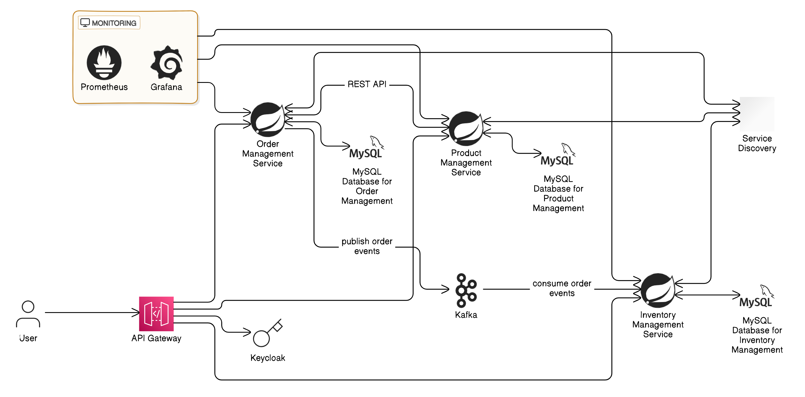

# Microservices Architecture Overview

This project illustrates a simple microservices architecture designed to efficiently handle user interactions and data management. The architecture utilizes a range of technologies to provide scalability, resilience, and high availability through a combination of synchronous and asynchronous communication.



## Components

### User
The end user interacts with the system via a user-friendly interface, sending requests to the API Gateway.

### API Gateway
- **Entry Point**: Serves as the single entry point for all client requests.
- **Routing & Load Balancing**: Manages routing of requests to the appropriate microservices and handles load balancing.
- **Security**: Integrates with [Keycloak](https://www.keycloak.org/) for user authentication and authorization, ensuring secure access to services.

### Service Discovery (Netflix Eureka)
- **Dynamic Discovery**: Facilitates the dynamic discovery of microservices, enabling them to locate each other without hard-coded endpoints.
- **Scalability**: Enhances scalability and resilience by allowing services to register themselves and discover other services on the fly.

### Microservices
Each service is encapsulated in a separate Spring Boot application, communicating either via REST APIs or asynchronous messages. The following microservices are included:

#### Functionality
- user can plced the order and then check inventoy service above product is availabe and after check the above product sale or not sale.and success the above process all services are communicate each other .and normally seprated service have own function like curd opertaion

### Save Order Method

The following is the implementation of the `saveOrder` method in the Order Management microservice:

```java
public OrderResponse saveOrder(OrderDTO orderDTO) {
    Integer itemId = orderDTO.getItemId();

    try {
        // Retrieve inventory details
        InventoryDTO inventoryResponse = inventoryWebClient.get()
                .uri(uriBuilder -> uriBuilder.path("/item/{itemId}").build(itemId))
                .retrieve()
                .bodyToMono(InventoryDTO.class)
                .block();

        // Check if inventory response is null (item not found)
        if (inventoryResponse == null) {
            return new ErrorOrderResponse("Item ID not found in inventory");
        }

        Integer productId = inventoryResponse.getProductId();

        // Retrieve product details
        ProductDTO productResponse = productWebClient.get()
                .uri(uriBuilder -> uriBuilder.path("/product/{productId}").build(productId))
                .retrieve()
                .bodyToMono(ProductDTO.class)
                .block();

        // Check if product response is null (product not found)
        if (productResponse == null) {
            return new ErrorOrderResponse("Product ID not found in product service");
        }

        // Check if the item is available in inventory
        if (inventoryResponse.getQuantity() > 0) {
            // Check if the item is for sale
            if (productResponse.getForSale() == 1) {
                // Save the order
                orderRepo.save(modelMapper.map(orderDTO, Orders.class));
                return new SuccessOrderResponse(orderDTO);
            } else {
                return new ErrorOrderResponse("This item is not for sale");
            }
        } else {
            return new ErrorOrderResponse("Item not available, please try later");
        }

    } catch (WebClientResponseException e) {
        if(e.getStatusCode().is5xxServerError()){
            return new ErrorOrderResponse("Item not available, please try later");
        }
    }
    return null;
}


### Database**: Uses a MySQL database for use  managing all data data.

### Communication
- **Synchronous Communication**: use the Webclinet.
- **Asynchronous Communication**: Kafka is utilized for message-driven interactions between Order Management and Inventory Management, ensuring decoupled communication and improved performance.

### Monitoring
The system incorporates monitoring tools to maintain high availability and performance:
- **Prometheus**: Collects metrics to track system performance and resource usage.
- **Grafana**: Provides a visualization dashboard for monitoring system health and performance metrics, enabling proactive maintenance and issue resolution.

## Getting Started

To get started with this project, clone the repository and follow the installation instructions in the respective microservice directories. Ensure that all services are configured to connect to the appropriate MySQL databases and that Kafka is set up for message handling.

## Contributing

Contributions to enhance the architecture, add features, or improve documentation are welcome. Please fork the repository and create a pull request for your changes.

## License

This project is licensed under the MIT License - see the [LICENSE](LICENSE) file for details.


